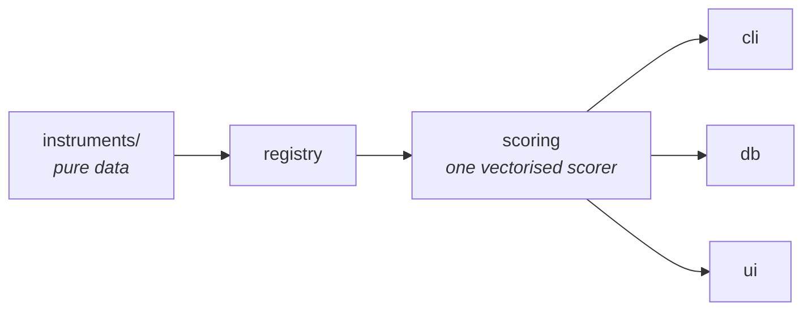

<div align="center">

<!-- PNG, not the SVG: PyPI strips SVG from project descriptions, so an SVG
     logo silently vanishes there while rendering fine on GitHub. The SVG is
     the source of truth and is used by the docs site and the application. -->


**Administer, score and record validated personality and affect questionnaires.**

[](https://github.com/fodorad/personality_questionnaire/releases)
[](https://pypi.org/project/personality_questionnaire/)
[](https://github.com/fodorad/personality_questionnaire/actions)
[](https://codecov.io/gh/fodorad/personality_questionnaire)
[](https://fodorad.github.io/personality_questionnaire/)
<br/>
[](https://www.python.org)
[](https://github.com/astral-sh/ruff)
[](LICENSE)

</div>

---

# What this is

Collecting validated self-reports is the unglamorous half of an affective-computing
pipeline. This package administers published psychometric instruments, scores them
correctly, and records every response with the provenance needed to reproduce the
score months later.

It is built around one idea: **an instrument is data, not code.** Items, response
ranges, subscale membership and reverse keys are declared as values; a single
vectorised scorer turns responses into scores without knowing which questionnaire it
is holding. Adding an instrument adds no arithmetic.

# Instruments

| Key | Instrument | Items | Scale | Scores |
| --- | --- | --- | --- | --- |
| `bfi2` | Big Five Inventory-2 | 60 | 1–5 | 5 domains, 15 facets |
| `bfi2-xs` | BFI-2 Extra-Short Form | 15 | 1–5 | 5 domains |
| `bfi10` | Big Five Inventory-10 | 10 | 1–5 | 5 domains |
| `panas` | Positive and Negative Affect Schedule | 20 | 1–5 | Positive/Negative Affect |
| `vasf` | Visual Analogue Scale to Evaluate Fatigue Severity | 18 | 0–10 | Fatigue, Energy, composite |

<sub>BFI-2 and BFI-2-XS: Soto & John (2017). BFI-10: Rammstedt & John (2007). PANAS:
Watson, Clark & Tellegen (1988). VAS-F: Lee, Hicks & Nino-Murcia (1991). See [docs/instruments.md](docs/instruments.md) for
full citations and licence notes.</sub>

<div align="center">


</div>

# Quickstart

Score responses you already have:

```bash
pip install personality_questionnaire
```

```python
import personality_questionnaire as pq

result = pq.score(pq.get("bfi2"), answers)  # answers: (n_participants, 60)
result.by_level("domain")  # {"openness": array([...]), ...}
result.as_dict()  # one participant, every subscale
```

Administer one at the terminal:

```bash
pq list                                  # what is available
pq info bfi2                             # items, subscales, citation
pq run bfi2 --participant P01            # ask, score, and store
pq score bfi2 --input answers.csv        # score a file
```

Collect and export a study:

```bash
pip install "personality_questionnaire[ui]"          # adds the record store
pq run bfi2 --participant P01 --experiment study-a
pq records                                            # what is stored
pq export --shape long --output study-a.csv
```

Records go to `~/.personality_questionnaire/records.db` unless `PQ_DATABASE_URL`
says otherwise. See [docs/storage.md](docs/storage.md).

Or collect through the application, which binds to localhost and never reaches the
network:

```bash
pq ui        # http://127.0.0.1:8080
```

Five tabs: an overview, setup, the questionnaire itself, the computed scores, and
every record collected so far with its exports. See [docs/ui.md](docs/ui.md).

# Try it without installing anything

A separate, stateless Gradio demo -- pick an instrument, answer it, see the scores
plotted (a radar for the Big Five forms, a bar chart for PANAS and VAS-F). Nothing
entered is stored: `demo/` never imports the database layer above, and
`tests/demo/test_isolation.py` enforces that at CI time, not just in prose.

```bash
pip install "personality_questionnaire[demo]"
pq demo        # http://127.0.0.1:7860
```

Deployable as a CPU-only Hugging Face Space (`sdk: docker`) via `make push-space`;
see `Dockerfile` and `demo/README.md`.

# How it works



| Module | Responsibility |
| --- | --- |
| `registry.py` | `Item`, `Subscale`, `Questionnaire` — what an instrument *is*, plus validation |
| `instruments/` | One module per questionnaire. Data only, no arithmetic |
| `scoring.py` | The single scorer: reverse-keying, subscale means, normalisation, pre/post deltas |
| `io.py` | Reading and writing responses and scores |
| `provenance.py` | Package version, git SHA, instrument hash for each record |
| `db/` | SQLAlchemy record store, and the JSON/wide/long export shapes |
| `core/` | Theme tokens, runtime settings, and the application's state |
| `pages/`, `app.py` | The localhost data-collection application |
| `cli/` | `pq list \| info \| run \| score \| records \| export \| ui` |

# Design decisions

**Instruments are Python literals, not data files.** A literal is checked by the type
checker, validated at import, and present in the wheel by construction. A shipped CSV
is checked by nothing until a participant has already answered every item — and the
two scale files this repo used to carry were never read by any code path *and*
misspelled `neuroticism`, which is exactly how unread data drifts.

**Reverse-keying belongs to the subscale, not the item.** The VAS-F scores its five
energy items forward in `Energy` and reversed in `Fatigue (composite)`, so a per-item
mask cannot express both. The reflection is folded into a signed weight matrix, which
also means every subscale at every level is computed by one matrix multiplication.

**Both hierarchy levels are declared flat.** The BFI-2's five domains and fifteen
facets are siblings, each listing its own item numbers, rather than domains being
composed from facets. The arithmetic is identical and the flat form scores both
levels in a single pass.

**Polarity is recorded as data.** Every subscale carries a `higher_is` string, so no
consumer has to infer direction from a name — the inference that produced the bug
below.

# Development

```bash
make dev          # install everything
make fix          # format and autofix
make check        # lint, type-check, test, docs -- mirrors CI
make check-ci     # the same, in a throwaway venv built like CI's
```

Tests are `unittest` under `coverage`, mirroring the package layout in `tests/`.

# Related work

[PersonalityLinMulT](https://github.com/fodorad/PersonalityLinMulT) predicts perceived
Big Five traits from video. This package sits on the other side of that problem: it
collects *self-reported* ground truth, on the same `[0, 1]` scale and in the same
`openness, conscientiousness, extraversion, agreeableness, neuroticism` column order,
so an exported BFI-2 record drops into a self-report-versus-perception comparison.
The two are deliberately uncoupled in code — this package has no ML dependencies.

# Citation

```bibtex
@software{fodor_personality_questionnaire,
  author = {Fodor, Ádám},
  title  = {personality_questionnaire: administering and scoring validated psychometric instruments},
  url    = {https://github.com/fodorad/personality_questionnaire},
}
```

# Contact

* Ádám Fodor (fodorad201@gmail.com) — [adamfodor.com](https://adamfodor.com)
